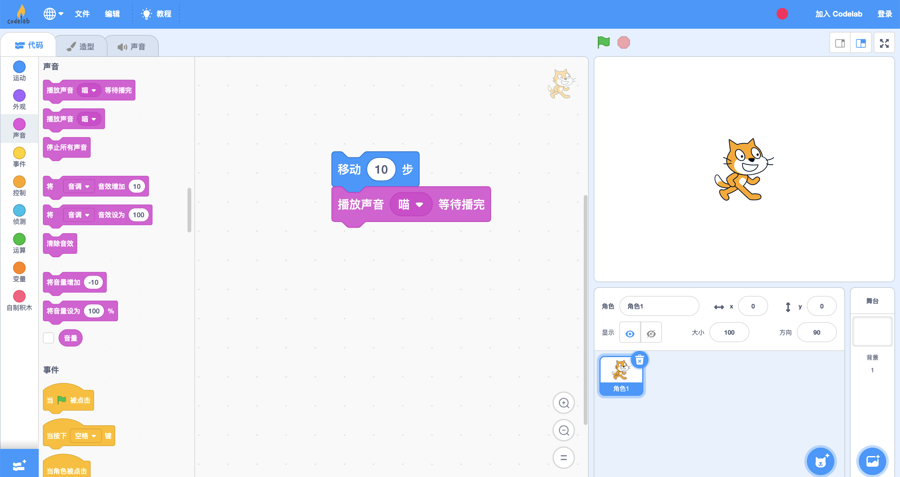
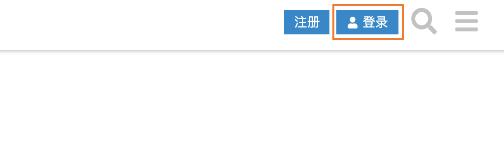
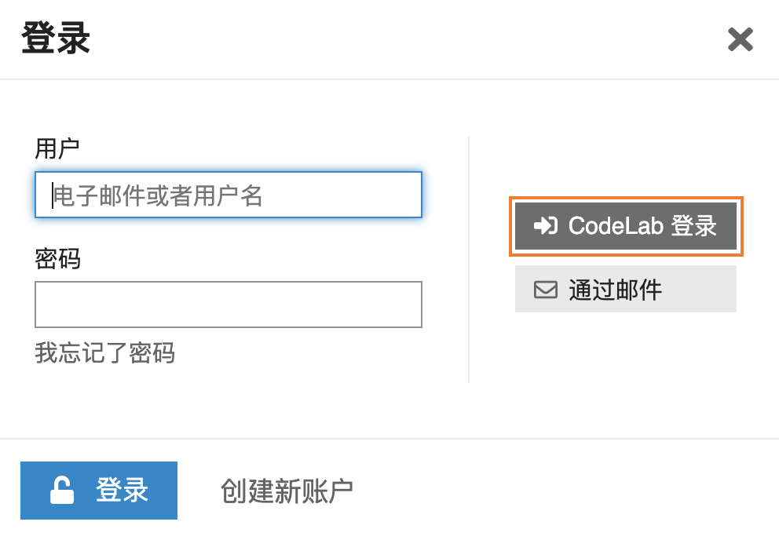
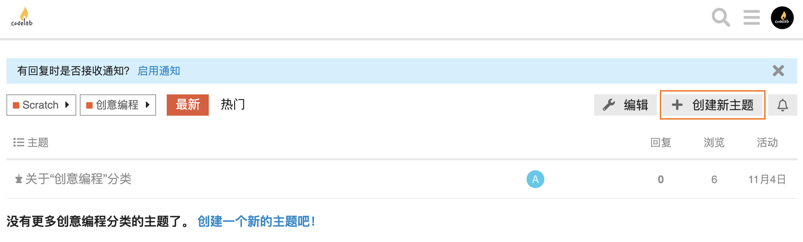
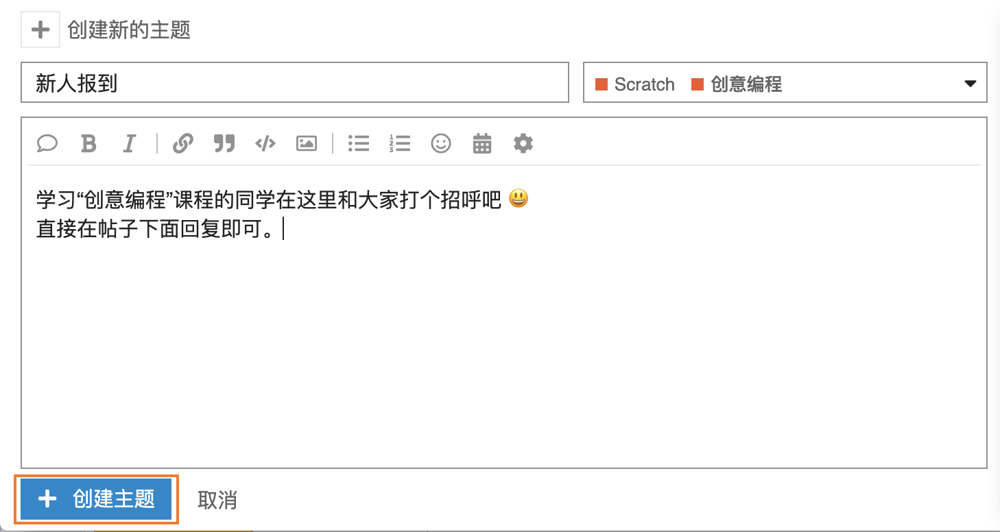
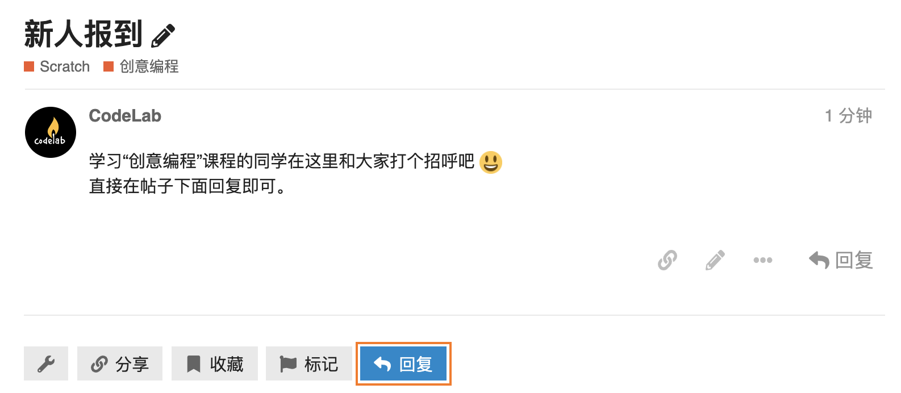
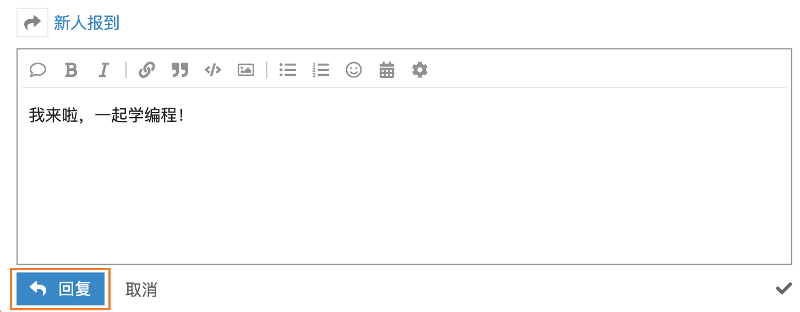

# 01 编程准备（上）

## 学习目标

* 了解 Scratch 是什么，能做什么
* 探索编程界面，创作第 1 个作品，注册编程账号
* 浏览 CodeLab 社区作品和工作室，学会创建工作室

## **学习流程**

### 1. 观看视频

观看视频[认识编程软件](https://www.bilibili.com/video/BV1jT4y1K7iA?p=1)、[探索编程界面](https://www.bilibili.com/video/BV1jT4y1K7iA?p=2)、[探索 CodeLab 社区](https://www.bilibili.com/video/BV1jT4y1K7iA?p=3)，了解 Scratch 能做什么，认识编程界面，浏览 CodeLab 社区，创建自己的工作室。

### 2. 完成课后拓展

拓展 1：继续探索编程界面，自主创作 1 个作品。

拓展 2：创建一个自己的工作室，并添加 3 个项目到工作室。

### 3. 互动交流

欢迎进入 [CodeLab 论坛](https://discuss.codelab.club/c/8-category/8)和大家讨论和交流，你可以分享你的学习心得，提问寻求帮助，帮助他人解决问题。先在[新人报到帖](https://discuss.codelab.club/t/topic/157)向大家打个招呼吧（如何发帖见下面编程百科[如何在论坛中发帖或回复](01-bian-cheng-zhun-bei-shang.md#2-ru-he-zai-lun-tan-zhong-fa-tie-huo-hui-fu)）。

### 4. 总结与反思

准备一个专门的笔记本，用它来记录你学习编程过程中的问题、灵感和心得。回顾自己的学习过程，在编程笔记中回答以下问题：

1. 你学到了什么？
2. 学习过程中你遇到的主要问题是什么？你是如何解决的？
3. 你发现了什么或者有什么想进一步了解的？

## 编程百科

### 1. Scratch 是什么？

Scratch 是麻省理工学院媒体实验室（MIT Media Lab）开发的一款图形化编程软件。它通过拼积木的方式编写程序，使用它可以创作动画、故事、音乐、游戏等项目。

### 2. 如何在论坛中发帖或回复？ 

先进入 [CodeLab 社区](https://create.codelab.club/)，登陆 CodeLab 账号，然后进入 [CodeLab 论坛](https://discuss.codelab.club/)，点击右上角的“登陆”按钮，

选择“CodeLab 登陆”，

进入论坛中相应的版块，选择“创建新主题”，

然后编辑帖子的主题和内容，点击“创建主题”按钮即可发布一个帖子。

如果想回复一个帖子，先进入帖子，点击“回复”按钮，

然后输入内容，点击“回复”按钮即可回复帖子。

## 学习资源

本单元相关的学习资源如下，浏览社区和编程时，推荐使用[谷歌浏览器](https://www.google.cn/chrome/index.html)。

* [Scratch 示例项目](https://create.codelab.club/studios/64/)
* [注册编程账号](https://create.codelab.club/join)
* [CodeLab 社区](https://create.codelab.club/)

