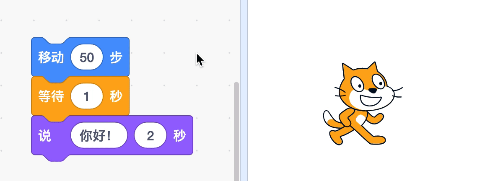
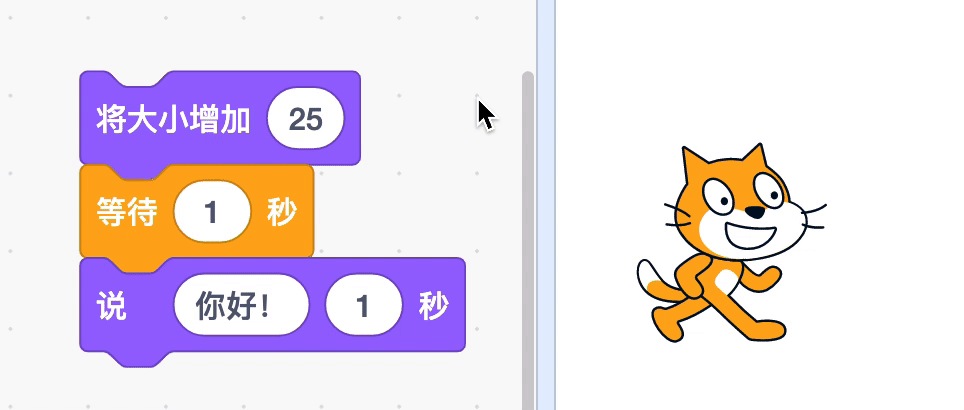

# 02 编程准备（下）

## 学习目标

* 了解编程是什么，认识概念“序列”
* 探索积木：动作、外观、音乐、画笔
* 在创作中实践“测试和调试”、“试验和迭代”

## **学习流程**

### 1. 观看视频

观看视频[小星星](https://www.bilibili.com/video/BV1jT4y1K7iA?p=4)、[小猫织地毯](https://www.bilibili.com/video/BV1jT4y1K7iA?p=5)。通过创作作品“小星星”了解“序列”概念和音乐积木。在创作“小猫织地毯”项目的过程中探索动作、外观、画笔积木。

### 2. 完成课后拓展

拓展 1：使用“音乐”积木自由创作一首歌曲，并分享到社区。

拓展 2：拓展“小猫织地毯”项目，尝试修改面向角度或添加更多画图角色等方式画出不同的图案。

### 3. 互动交流

欢迎进入 [CodeLab 论坛](https://discuss.codelab.club/c/8-category/8)和大家讨论和交流，你可以分享你的学习心得，提问寻求帮助，帮助他人解决问题。

### 4. 总结与反思

回顾自己的学习过程，在编程笔记中回答这两个问题：

1. 你学到了什么？
2. 学习过程中你遇到的主要问题是什么？你是如何解决的？
3. 你发现了什么或者有什么想进一步了解的？

## 编程百科

### 1. 什么是编程？

编程是给计算机发布指令，让它完成任务，比如让小猫移动。编程语言是我们用来和计算机沟通的语言，我们使用的 Scratch 是一门图形化编程语言。通过编程，我们和计算机“对话”，甚至能让计算机成为我们亲密的伙伴，帮助我们创作有趣的动画、故事、游戏作品。

### 2. 如何理解“序列”？

序列是程序中指令执行的顺序，程序一般是从上往下逐个指令执行的。在下图中，小猫先变大，等待 1 秒后再说话。

如果调整积木的顺序，那么小猫的动作会不一样，所以编程时要注意积木的顺序。

### 3. 小星星完整简谱

> 1 1 5 5 6 6 5 -   4 4 3 3 2 2 1 - 
>
> 5 5 4 4 3 3 2 -   5 5 4 4 3 3 2 - 
>
> 1 1 5 5 6 6 5 -   4 4 3 3 2 2 1 -

其中 **-** 代表休止 0.25 拍。

## 学习资源

* [小星星工作室](https://create.codelab.club/studios/278/)
* [小猫织地毯工作室](https://create.codelab.club/studios/280/)
* [交流答疑专区](https://discuss.codelab.club/c/8-category/32-category/32)
* [完整版小星星](https://create.codelab.club/projects/5913/)

