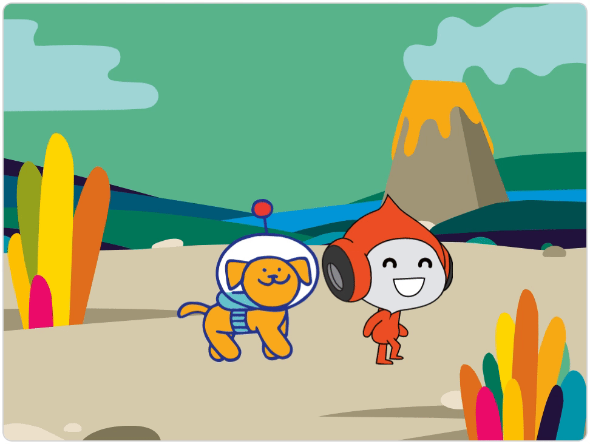
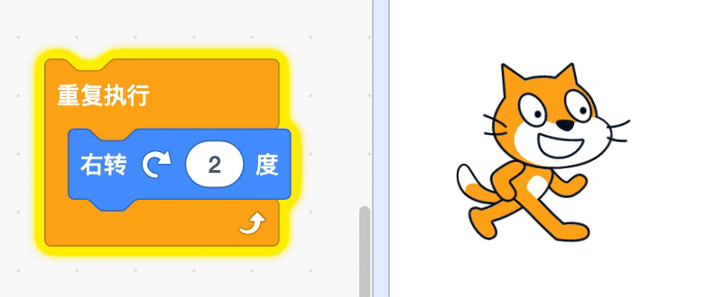
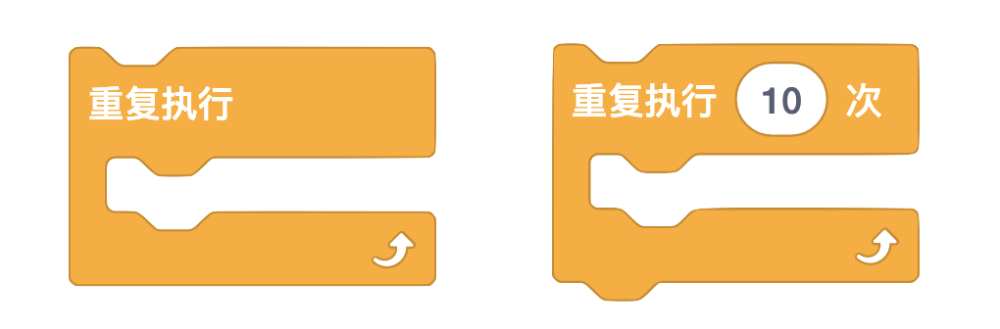
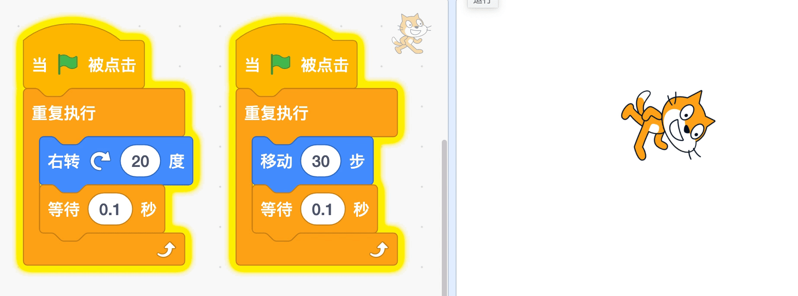
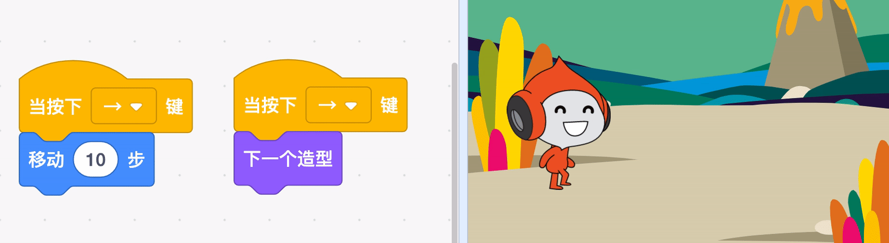

# 03 动画制作（上）

## 学习目标

* 探索概念：循环、事件、并行
* 熟悉积木：重复执行、当按下 x 键、换成 x 造型
* 了解动画原理，学会使用画板设计造型外观
* 主题创作：学习通过切换造型和移动角色来创作动画
* 在创作中实践“试验和迭代”、“测试和调试”

## 学习流程

### 1. 观看视频

观看视频[表情动画](https://www.bilibili.com/video/BV1jT4y1K7iA?p=6)、[Pico 和 Dot 散步](https://www.bilibili.com/video/BV1jT4y1K7iA?p=7)。通过创作“表情动画”了解动画原理。创作动画“Pico 和 Dot 散步”项目，探索可以和键盘互动的动画。

### 2. 完成课后拓展

拓展 1：设计新的表情动画，并将作品添加到[表情动画](https://create.codelab.club/studios/294/)工作室。

拓展 2：拓展“Pico 和 Dot 散步”项目，添加按下左键 Pico 和 Dot 都朝左移动的功能。

### 

### 3. 互动交流

欢迎进入 [CodeLab 论坛](https://discuss.codelab.club/c/8-category/8)和大家讨论和交流，你可以分享你的学习心得，提问寻求帮助，帮助他人解决问题。

### 4. 总结与反思

回顾自己的学习过程，在编程笔记中回答以下问题：

1. 你学到了什么？
2. 学习过程中你遇到的主要问题是什么？你是如何解决的？
3. 你发现了什么或者有什么想进一步了解的？

## 编程百科

### 1. 什么是“循环”？

在编程中，循环表示一件事情多次发生，相关的积木是重复执行。下图中的程序使用了重复执行积木让小猫一直旋转。

“重复执行”和“重复执行 10 次”这两个积木有什么区别呢？编写程序测试一下吧！

### 2. 如何理解“并行”？

并行是指多个事情同时发生。比如小猫边移动边右转，要让多个事情同时发生，可以使用“事件”中的积木触发动作，比如“当绿旗被点击”。

### 3. 走路动画

动画就是动起来的画面。要设计走路动画，可以一边让角色移动，一边切换角色走路的造型。

## 学习资源

* [表情动画工作室](https://create.codelab.club/studios/294)
* [走路动画工作室](https://create.codelab.club/studios/296/)
* [交流答疑专区](https://discuss.codelab.club/c/8-category/32-category/32)
* [手翻书动画](https://www.bilibili.com/video/BV17J411Q7yg)

