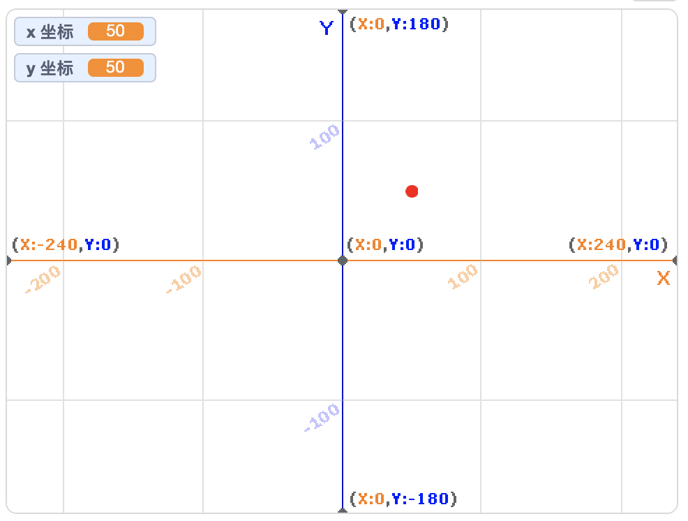
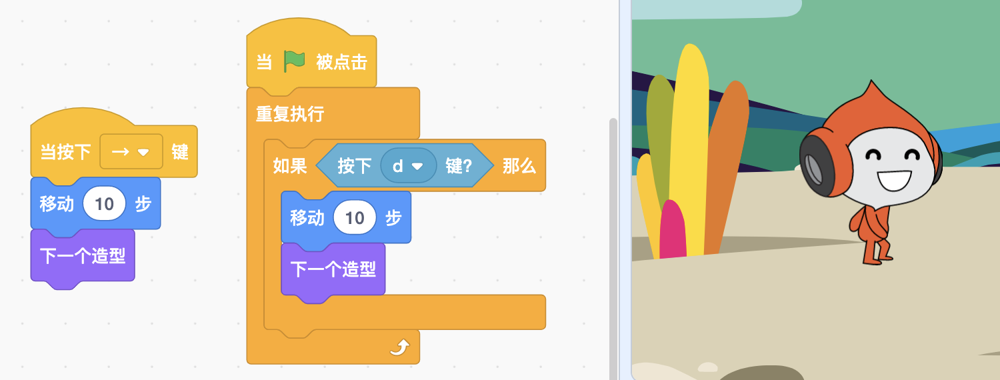

# 04 动画制作（下）

## 学习目标

* 探索概念：循环、事件、条件
* 熟悉积木：重复执行直到、移到、将 x/y 坐标增加、如果那么、显示、隐藏
* 体验声音互动，了解坐标，学会使用按键控制角色移动
* 主题创作：学习通过改变角色大小和移动角色来创作动画
* 在创作中实践“试验和迭代”、“测试和调试”

## **学习流程**

### 1. 观看视频

观看视频[吹气球](https://www.bilibili.com/video/BV1jT4y1K7iA?p=8)、[骑扫帚飞行](https://www.bilibili.com/video/BV1jT4y1K7iA?p=9)。通过创作“吹气球”作品体验通过声音和角色互动。创作“骑扫帚飞行”作品，学会使用键盘控制角色飞行。

### 2. 完成课后拓展

拓展 1：设计新的角色大小发生变化的动画，比如慢慢变大或变小，并将作品添加到[大小变变变](https://create.codelab.club/studios/350)工作室。

拓展 2：拓展“骑扫帚飞行”作品，增加新的飞行角色，组成飞行小队，并将作品添加到[飞行](https://create.codelab.club/studios/351/)工作室。

### 3. 互动交流

欢迎进入 [CodeLab 论坛](https://discuss.codelab.club/c/8-category/8)和大家讨论和交流，你可以分享你的学习心得，提问寻求帮助，帮助他人解决问题。

### 4. 总结与反思

回顾自己的学习过程，在编程笔记中回答以下问题：

1. 你学到了什么？
2. 学习过程中你遇到的主要问题是什么？你是如何解决的？
3. 你发现了什么或者有什么想进一步了解的？

## 编程百科

### 1. 什么是“坐标”？

坐标表示角色在舞台上的位置。坐标包含代表水平方向的 x 坐标，舞台正中央的 x 坐标是 0，往右，x 坐标增加，往左，x 坐标减少。y 坐标代表竖直方向的位置。舞台正中央的 y 坐标是 0，往上，y 坐标增加，往下，y 坐标减少。体验“[认识坐标](https://create.codelab.club/projects/1201/)”这个作品，实时查看角色移动时的坐标变化吧！

### 2. 两种控制角色移动的方式

控制角色移动有两种方式：1. 直接使用事件积木和移动积木（左侧的积木）；2. 在重复执行积木中检测是否按下按键，如果是则让角色移动（右侧的积木）。第 2 种方法相比第 1 种方法可以让角色移动更顺畅，编写程序测试一下吧！

## 学习资源

* [大小变变变工作室](https://create.codelab.club/studios/350)
* [飞行工作室](https://create.codelab.club/studios/351/)
* [交流答疑专区](https://discuss.codelab.club/c/8-category/32-category/32)
* [舞蹈派对](https://create.codelab.club/projects/1533/)
* [火柴人飞行](https://create.codelab.club/projects/4318/)

