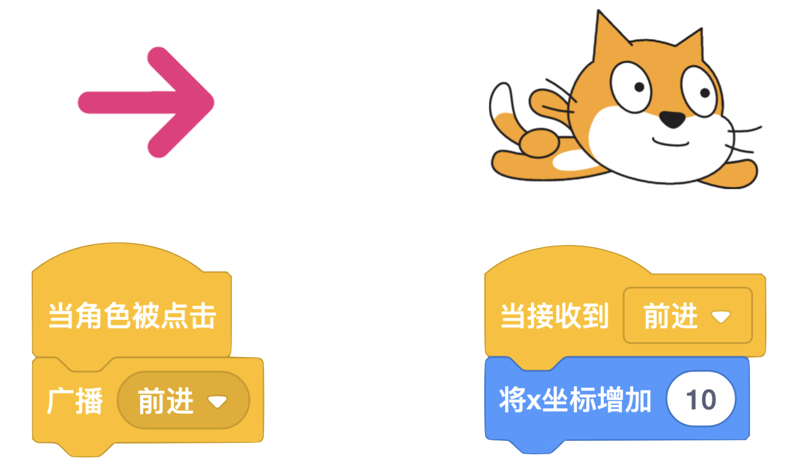

# 05 故事创作（上）

## 学习目标

* 探索概念：事件
* 熟悉积木：当角色被点击、广播、当收到广播、将大小增加
* 学会使用等待和广播积木协调对话
* 主题创作：了解四格漫画的基本元素，使用 4 个场景创作一个故事
* 在创作中实践“试验和迭代”、“测试和调试”

## **学习流程**

### 1. 观看视频

观看视频[猜谜语](https://www.bilibili.com/video/BV1jT4y1K7iA?p=10)和[四格漫画](https://www.bilibili.com/video/BV1jT4y1K7iA?p=11)。通过创作“猜谜语”作品学会创建角色对话。创作“四格漫画”作品，了解如何创作一个故事。

角色对话如下，编程时可直接复制-粘贴对话。

**猜谜语**

* 小猫：来玩猜谜语的游戏吗？
* Pico：好呀
* 小猫：千根线，万根线，落到水里就不见
* Pico：嗯……
* 小猫：答案是雨
* Pico：啊，原来如此

**四格漫画**

* 魔法师：我要练习魔法，成为魔法学徒。
* 魔法师：变大
* 魔法师：变小
* 魔法师：变大
* 王子：啊，终于变回来了

### 2. 完成课后拓展

拓展 1：设计新的猜谜语游戏，谜语可以在网络上搜索，并将作品添加到[对话](https://create.codelab.club/studios/354/)工作室。

拓展 2：根据所学的广播知识，创作一个日常的对话或小故事，并将作品添加到[对话](https://create.codelab.club/studios/354/)工作室。

### 3. 互动交流

欢迎进入 [CodeLab 论坛](https://discuss.codelab.club/c/8-category/8)和大家讨论和交流，你可以分享你的学习心得，提问寻求帮助，帮助他人解决问题。

### 4. 总结与反思

回顾自己的学习过程，在编程笔记中回答这两个问题：

1. 你学到了什么？
2. 学习过程中你遇到的主要问题是什么？你是如何解决的？
3. 你发现了什么或者有什么想进一步了解的？

## 编程百科

### 1. 如何理解“广播”？

编程中的“广播”和日常生活中的广播比较相似，它们都是传递信息的一种方式。角色可以发送和接收广播。角色发出广播后，另一个角色接收到广播后可以做出相应的动作。广播经常用在角色沟通的场景中，比如对话。体验“[广播示例](https://create.codelab.club/projects/7217/)”项目，进一步了解广播的作用吧！

## 学习资源

* [对话工作室](https://create.codelab.club/studios/354/)
* [四格漫画工作室](https://create.codelab.club/studios/355/)
* [交流答疑专区](https://discuss.codelab.club/c/8-category/32-category/32)
* [广播示例](https://create.codelab.club/projects/7217/)

