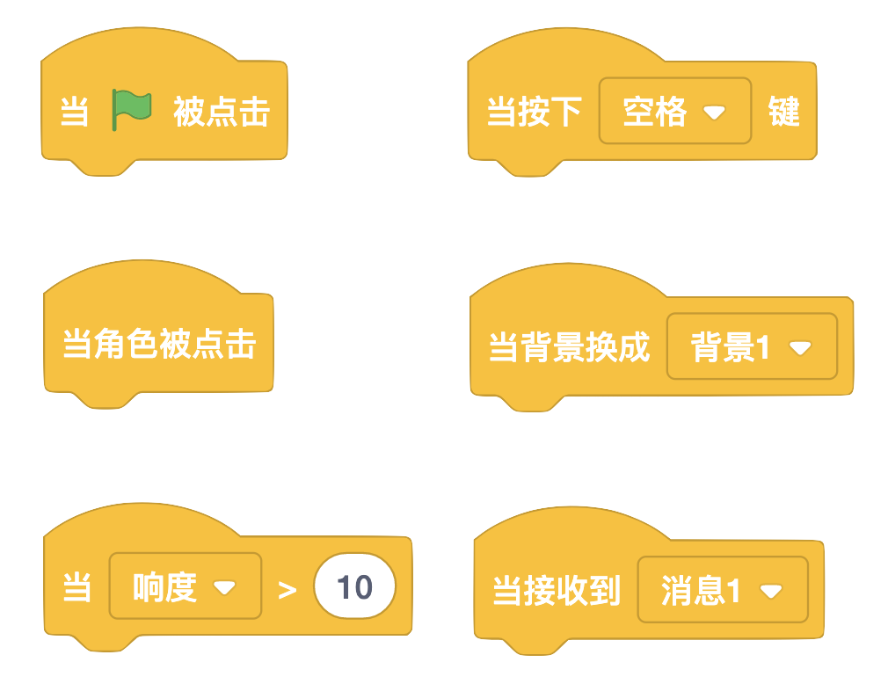

# 06 故事创作（下）

## 学习目标

* 探索概念：事件、并行
* 熟悉积木：换成 x 背景、当背景换成 x、碰到、清除图形特效
* 学会切换场景和使用录音功能
* 主题创作：使用多个场景创作一个故事，并对故事进行配音
* 在创作中实践“试验和迭代”、“测试和调试”、“重用和改编”

## **学习流程**

### 1. 观看视频

观看视频[时空穿梭](https://www.bilibili.com/video/BV1jT4y1K7iA?p=12)和[故事配音](https://www.bilibili.com/video/BV1jT4y1K7iA?p=13)。通过创作“时空穿梭”作品学会创建多场景故事。创作“故事配音”作品，通过配音让故事更加生动。

时空穿梭角色对话如下，编程时可直接复制-粘贴对话。

* 场景 1
  * 魔法阵：通向未知世界的魔法阵。
* 场景 2
  * 哥布林：欢迎来到矮人王国！这里有神秘的魔法，进入这里的生物都会变小。
  * 小猫：啊，那怎么办？
  * 哥布林：你可以找魔法师寻求帮助。
* 场景 3
  * 小猫：魔法师，你能将我变大吗？
  * 魔法师：没问题，看我施放魔法。
  * 小猫：谢谢您！

### 2. 完成课后拓展

拓展 1：对故事配音作品进行拓展，添加新的场景，并将作品添加到[故事配音](https://create.codelab.club/studios/360/)工作室。

拓展 2：根据所学的配音知识，创作一个新的配音故事，并将作品添加到[故事配音](https://create.codelab.club/studios/360/)工作室。

### 3. 互动交流

欢迎进入 [CodeLab 论坛](https://discuss.codelab.club/c/8-category/8)和大家讨论和交流，你可以分享你的学习心得，提问寻求帮助，帮助他人解决问题。

### 4. 总结与反思

回顾自己的学习过程，在编程笔记中回答这两个问题：

1. 你学到了什么？
2. 学习过程中你遇到的主要问题是什么？你是如何解决的？
3. 你发现了什么或者有什么想进一步了解的？

## 编程百科

### 1. 切换场景

在故事或游戏中经常需要切换不同的场景。这个时候可以使用切换背景相关的积木：换成 x 背景、下一个背景、当背景换成 x。下图中的示例设置了初始背景，通过箭头可以切换背景，当切换到“Space City 1”这个背景时，箭头会隐藏。

### 2. 理解“事件“

在编程中，“事件”是指一件事引起另一件事发生。事件相关的积木如下图所示，事件积木中包含了不同和角色互动的方式，比如点击角色，按下按键。在之前的学习过程中，我们其实经常接触到事件积木。

## 学习资源

* [时空穿梭工作室](https://create.codelab.club/studios/359/)
* [故事配音工作室](https://create.codelab.club/studios/360/)
* [交流答疑专区](https://discuss.codelab.club/c/8-category/32-category/32)
* [城堡探险](https://create.codelab.club/projects/1560/)
* [贺卡](https://create.codelab.club/projects/1539/)

