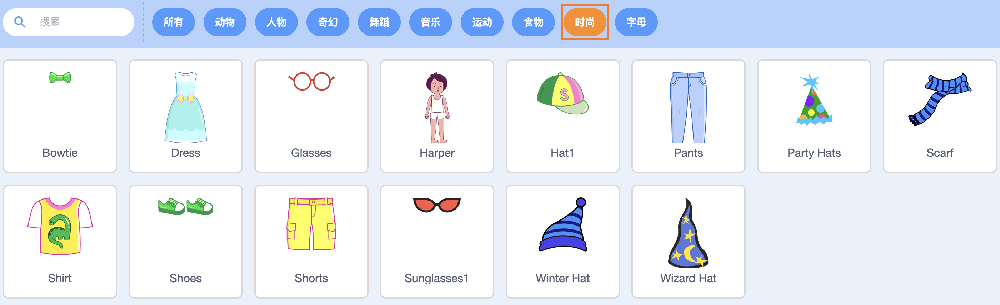
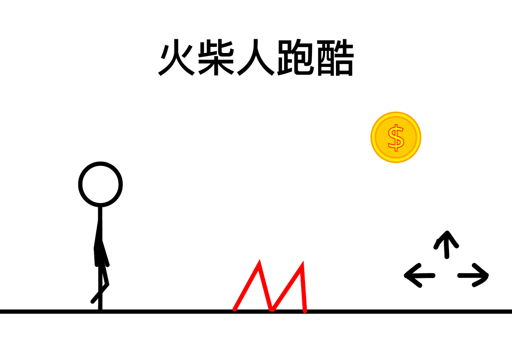
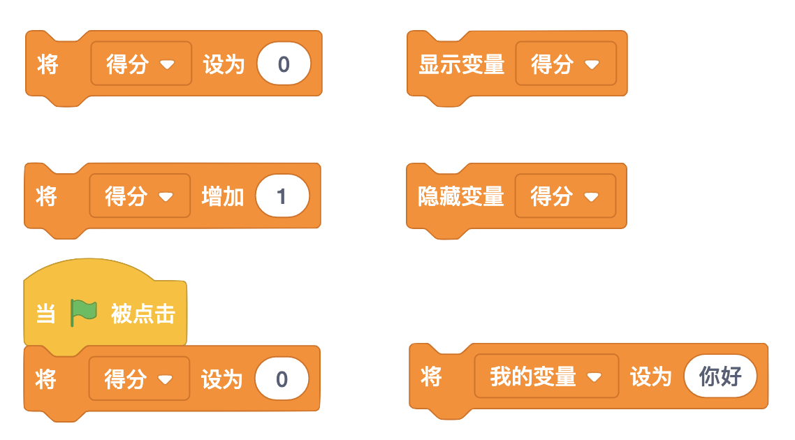

# 07 游戏设计（上）

## 学习目标

* 探索概念：条件、运算、数据
* 熟悉积木：在 x 秒内滑行到、比较大小、取随机数、变量
* 学会设计造型，如修改造型的图案和颜色
* 主题创作：了解游戏的常见元素，设计互动游戏
* 在创作中实践“试验和迭代”、“测试和调试”、“重用和改编”

## 学习流程

### 1. 观看视频

观看视频[装扮 Harper](https://www.bilibili.com/video/BV1jT4y1K7iA?p=14) 和[飞越魔法森林](https://www.bilibili.com/video/BV1jT4y1K7iA?p=15)。通过创作“装扮 Harper”作品学会设计造型。创作“飞越魔法森林”作品，学会使用变量。

装扮 Harper 角色对话如下，编程时可直接复制-粘贴对话。

* Harper：今天我要参加一个派对，帮我装扮一下吧！

### 2. 完成课后拓展

拓展 1：对“装扮 Harper” 进行拓展，设计新的衣服造型，或者添加新的服装角色，并将作品添加到[换装游戏](https://create.codelab.club/studios/362/)工作室。

拓展 2：给游戏“飞越魔法森林”添加更多角色和功能，让玩法更丰富，并将作品添加到[飞行游戏](https://create.codelab.club/studios/363/)工作室。

### 3. 互动交流

欢迎进入 [CodeLab 论坛](https://discuss.codelab.club/c/8-category/8)和大家讨论和交流，你可以分享你的学习心得，提问寻求帮助，帮助他人解决问题。

### 4. 总结与反思

回顾自己的学习过程，在编程笔记中回答这两个问题：

1. 你学到了什么？
2. 学习过程中你遇到的主要问题是什么？你是如何解决的？
3. 你发现了什么或者有什么想进一步了解的？

## 编程百科

### 1. 游戏中的常见元素

回顾一下你玩过的游戏，这些游戏有什么共同点呢？游戏有一些常见的元素，比如得分、关卡、敌人、奖励。这些游戏元素可以让你的游戏玩法更丰富。想知道如何设计这些游戏元素吗？看看[拓展](https://create.codelab.club/studios/86/)工作室中的作品吧！

### 2. 变量

变量就是一种可以发生变化的值。游戏得分经常会改变，所以变量非常适合用来记录游戏的得分。在游戏开始的时候，可以将得分变量设为 0，并且设置得分增加或减少的条件。让得分变量显示可以让我们实时观察得分的变化。变量可以是数字，也可以是字符，比如“你好”。为了使用变量，我们要给变量取一个名字，也就是变量名，比如“得分”。

## 学习资源

* [换装游戏工作室](https://create.codelab.club/studios/362/)
* [飞行游戏工作室](https://create.codelab.club/studios/363/)
* [交流答疑专区](https://discuss.codelab.club/c/8-category/32-category/32)
* [拓展工作室](https://create.codelab.club/studios/86/)

