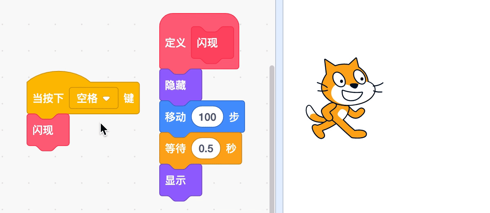

# 09 深入探究（上）

## 学习目标

* 熟悉积木：自制积木、克隆、当作为克隆体启动时、右转 x 度
* 学会使用画笔积木绘制几何图案，能够使用克隆积木生成角色的克隆体
* 主题创作：探索几何图案的奥秘，使用克隆积木拓展游戏作品
* 在创作中实践“试验和迭代”、“测试和调试”、“抽象和模块化”、“重用和改编”

## 学习流程

### 1. 观看视频

观看视频[画笔几何](https://www.bilibili.com/video/BV1jT4y1K7iA?p=18)和[植树造林](https://www.bilibili.com/video/BV1jT4y1K7iA?p=19)。通过创作“画笔几何”作品熟悉自制积木。创作“植树造林”作品掌握克隆积木的使用。

### 2. 完成课后拓展

拓展 1：拓展“画笔几何”项目画出以下图案，可能要用到“抬笔”积木，并将作品添加到[画笔几何](https://create.codelab.club/studios/368/)工作室。

拓展 2：使用克隆积木拓展”飞镖大作战拓展“项目，并将作品添加到[角色克隆](https://create.codelab.club/studios/369/)工作室。

### 3. 互动交流

欢迎进入 [CodeLab 论坛](https://discuss.codelab.club/c/8-category/8)和大家讨论和交流，你可以分享你的学习心得，提问寻求帮助，帮助他人解决问题。

### 4. 总结与反思

回顾自己的学习过程，在编程笔记中回答这两个问题：

1. 你学到了什么？
2. 学习过程中你遇到的主要问题是什么？你是如何解决的？
3. 你发现了什么或者有什么想进一步了解的？

## 编程百科

### 1. 自制积木

除了使用已有的积木编写程序，我们还可以设计自己的积木。设计积木时，先定义积木的功能，然后它就可以像普通积木一样使用。自制积木用一个积木代替一段积木，程序看起来更清晰和有条理。

### 2. 克隆

克隆可以生成和角色一样的新角色，生成的角色我们叫它克隆体。生成克隆体后，“当作为克隆体启动时”这个积木会马上运行，可以将控制克隆体的积木放在这个积木下。使用克隆功能可以很方便地生成很多相同的角色，在游戏中会经常用到。

## 学习资源

* [画笔几何工作室](https://create.codelab.club/studios/368/)
* [角色克隆工作室](https://create.codelab.club/studios/369/)
* [交流答疑专区](https://discuss.codelab.club/c/8-category/32-category/32)
* [组合多边形](https://create.codelab.club/projects/7887/)

