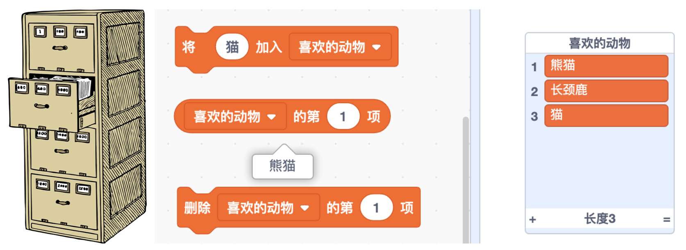

# 10 深入探究（下）

## 学习目标

* 熟悉积木：询问、修改列表、获取列表内容
* 学会创作通过用户输入进行互动的项目，回顾总结课程所学内容
* 在创作中实践“试验和迭代”、“测试和调试”

## **学习流程**

### 1. 观看视频

观看视频[弹幕发射](https://www.bilibili.com/video/BV1jT4y1K7iA?p=20)和[学习总结](https://www.bilibili.com/video/BV1jT4y1K7iA?p=21)。通过创作“弹幕发射”作品熟悉列表的使用，总结课程所学内容。

### 2. 完成课后拓展

拓展 1：拓展“弹幕发射”项目，加入自己的创意，比如出现不同造型的弹幕或让弹幕循环出现，并将作品添加到[弹幕发射](https://create.codelab.club/studios/370)工作室。

拓展 2：根据课程所学知识，自主创作一个项目，并将它添加到[综合创作](https://create.codelab.club/studios/371/)工作室。

### 3. 互动交流

欢迎进入 [CodeLab 论坛](https://discuss.codelab.club/c/8-category/8)和大家讨论和交流，你可以分享你的学习心得，提问寻求帮助，帮助他人解决问题。

### 4. 总结与反思

回顾自己的学习过程，在编程笔记中回答以下问题：

1. 你学到了什么？
2. 学习过程中你遇到的主要问题是什么？你是如何解决的？
3. 你发现了什么或者有什么想进一步了解的？

## 编程百科

### 1. 列表

列表可以存放多个值，它就像一个有多个抽屉的储物柜。下图中新建了 1 个列表“喜欢的动物”，列表第 1 项是熊猫，列表左侧的数字 1、2、3 代表列表中内容的编号，现在列表的长度是 3。列表比储物柜更加灵活，它可以随时加入或删除内容，列表的长度也可以不断变化。

## 学习资源

* [弹幕发射工作室](https://create.codelab.club/studios/370)
* [综合创作工作室](https://create.codelab.club/studios/371/)
* [交流答疑专区](https://discuss.codelab.club/c/8-category/32-category/32)
* [CodeLab 入门页面](https://create.codelab.club/ideas)

