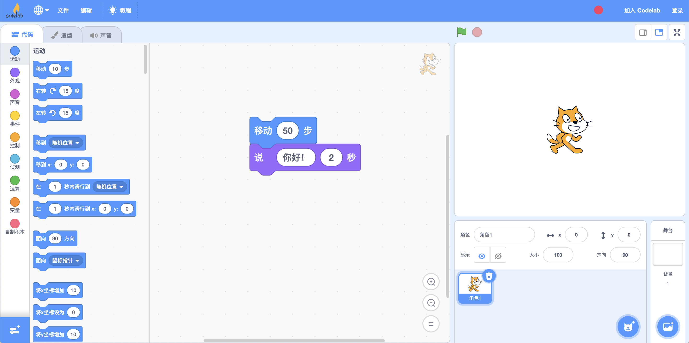
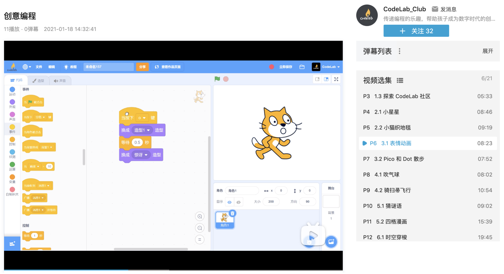
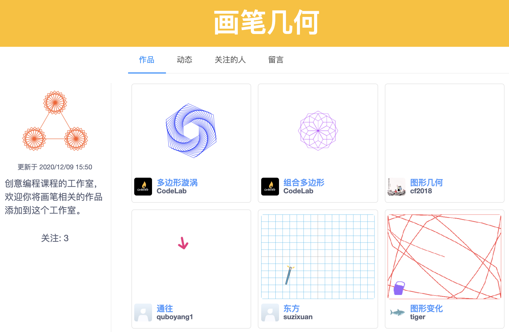

# 课程介绍

## 课程概览

### 什么是创意编程？

[创意编程](https://creative-coding.codelab.club/)（Creative Coding）是 [CodeLab](https://www.codelab.club/) 围绕创意实现而设计的一门编程入门课程。创意编程使用图形化编程工具，通过拼接积木来编写程序。它围绕动画制作、故事创作、游戏设计三大主题进行设计，学习者在情境化的项目实践中理解编程的基本概念，在计算思维的框架下和媒体互动并表达创意，在 [CodeLab 社区](https://create.codelab.club/)中学习、交流，甚至找到同伴，一起探索编程的乐趣。

创意编程课程在内容框架设计上借鉴了哈佛大学教育研究生院 ScratchEd 团队开发的[创意计算](http://scratched.gse.harvard.edu/guide/)课程。创意编程包含 10 个单元：

1. 编程准备（上）
2. 编程准备（下）
3. 动画制作（上）
4. 动画制作（下）
5. 故事创作（上）
6. 故事创作（下）
7. 游戏设计（上）
8. 游戏设计（下）
9. 深入探究（上）
10. 深入探究（下）

第 1-2 单元探索编程工具和社区，并尝试创作两个项目，了解编程的可能性。第 3-8 单元围绕动画、故事、游戏这三大主题进行创作。第 9-10 单元进行深入拓展，并总结之前所学知识。

### 适合什么人学习？

创意编程是为零基础编程入门者开发的课程，只要你对编程感兴趣或者想了解编程能做什么，并且年龄在 8 岁以上，就可以开始学习和探索。

### 如何使用？

创意编程的学习资料包含[**视频**](https://www.bilibili.com/video/BV1jT4y1K7iA)和[**学习讲义**](https://creative-coding.codelab.club/)，学习的时候建议两者搭配使用。

学习讲义包含以下内容：

* **学习目标**：明确本单元的学习目标，可作为学习者检查学习成果的参考标准
* **学习流程**：包含观看视频，完成课后拓展，互动交流，总结和反思 4 个部分，建议按照流程进行学习。如果对课程中出现的概念不理解，可以查看编程百科
* **编程百科**：提炼本单元的编程知识点，作为学习参考和知识回顾
* **学习资源**：提供本单元进一步学习的资料或项目

本课程以自学为主，也可作为多人一起学习编程的学习材料，学习进度可自由把控，建议每次学习 1 个单元。如果小朋友对电脑的基本操作不熟悉，建议在家长的陪同下学习课程。我们同样鼓励你在 [CodeLab 社区](https://create.codelab.club/)和其他学习者一起交流，甚至找同伴一起学习课程，这样你会收获更多创作灵感和乐趣。

## 设计原则

### 创意实现

创意编程围绕创意的实现和表达进行设计，在具体情境中融入编程知识，侧重点在动画、故事、游戏的创作。通过编程进行创作表达也融合在了课程设计中，视频开头、结尾和部分概念的讲解也是使用图形化编程工具制作的。

### 低门槛、宽围墙

创意编程使用图形化编程工具，学习者通过拼积木进行编程，容易使用和学习，结合媒体（动画、音乐）丰富的表现力，学习者可以自由探索和测试。课程涵盖了动画、故事、游戏三大主题，兼顾了不同学习者的兴趣。

### 学习社区

同伴是创作灵感和学习乐趣的来源，创意编程重视同伴的力量，为此专门构建了学习社区。课程工作室可以收集大家创作的相同主题的作品，它们是丰富的学习素材。[CodeLab 论坛](https://discuss.codelab.club/)专门开设了“[创意编程](https://discuss.codelab.club/c/8-category/32-category/32)”讨论区，供大家讨论学习过程中遇到的问题。[CodeLab 社区](https://create.codelab.club/)丰富的作品和开放的创作交流氛围为学习者进一步创作提供了支持。

## 致谢

创意编程课程的设计受到了哈佛大学教育研究生院 ScratchEd 团队开发的[创意计算](http://scratched.gse.harvard.edu/guide/)课程的启发，感谢他们的开放和开源精神。本课程的视频录制和制作同样得到了[英荔教育](https://www.eliteu.cn/)的大力支持，特别感谢@Kenny 制作课程视频并协助视频录制，感谢@leeyve 安排人员和场地。

## 使用协议

本课程以[ CC BY-NC-SA 4.0](https://creativecommons.org/licenses/by-nc-sa/4.0/deed.zh) 协议发布。

